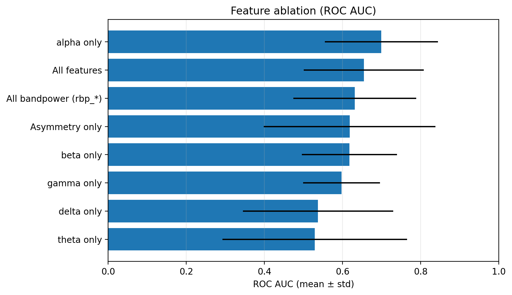
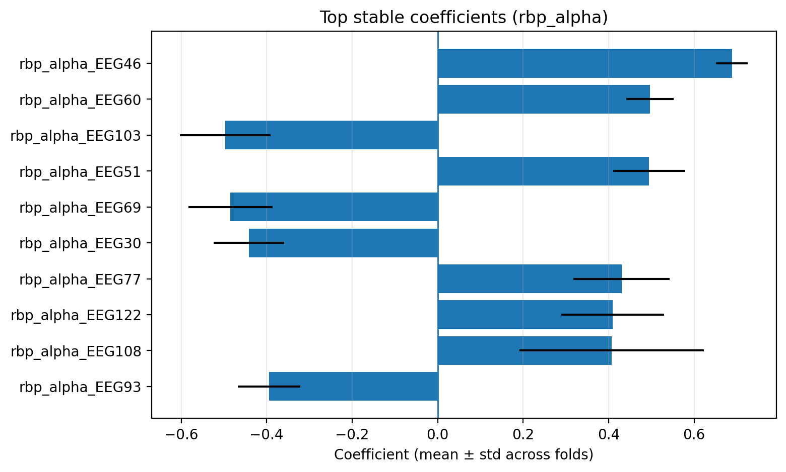

# EEG-Based Depression Classification (MODMA)

## Overview

This project investigates EEG biomarkers of Major Depressive Disorder (MDD) using resting-state electroencephalography data from the MODMA dataset. The analysis focuses on interpretable, band-specific features combined with cross-validated machine learning models to identify neural signatures associated with depression.

## Dataset

**MODMA EEG Dataset**
- 128-channel resting-state EEG recordings
- 53 subjects (MDD patients vs. healthy controls)
- Collected at Lanzhou University, 2015

## Installation & Setup

### 1. Clone the Repository
```bash
git clone https://github.com/<your-username>/modma-depression-eeg.git
cd modma-depression-eeg
```

### 2. Create Virtual Environment
```bash
python3 -m venv .venv
source .venv/bin/activate   # On macOS/Linux
# .venv\Scripts\activate    # On Windows
python -m pip install --upgrade pip
pip install -r requirements.txt
pip install -e .
```

### 3. Download Dataset
Place the MODMA EEG dataset in the `data/MODMA/` directory. The analysis requires the subject metadata file:
```
subjects_information_EEG_128channels_resting_lanzhou_2015.xlsx
```

### 4. Run Analysis
Execute the notebooks in sequential order:
1. `notebooks/01_exploration_clean.ipynb` — Data exploration and preprocessing
2. `notebooks/02_modeling_clean.ipynb` — Model training and evaluation

Generated figures are automatically saved to `assets/figures/`.

## Methodology

**Preprocessing**
- Bandpass filtering and signal epoching
- Artifact rejection using MNE-Python

**Feature Engineering**
- Relative bandpower across canonical frequency bands (delta, theta, alpha, beta, gamma)
- Hemispheric asymmetry indices
- Regional power distributions

**Machine Learning**
- Logistic regression with balanced class weights
- Stratified 5-fold cross-validation
- ROC AUC as primary performance metric

## Results

| Approach | ROC AUC |
|----------|---------|
| Baseline (all features) | ~0.65 |
| Alpha-band features only | ~0.79 |

**Key Findings:**
- Alpha-band features significantly outperform other frequency bands
- Strong evidence of hemispheric alpha asymmetry in MDD patients
- Stable alpha features provide robust classification performance

## Visualizations

### Feature Ablation Analysis

*Performance comparison across different frequency band features*

### Top Discriminative Features

*Most important alpha-band features for MDD classification*

## Clinical Interpretation

The results align with established neurophysiological research indicating that alpha-band EEG activity and hemispheric imbalance are key neural correlates of depressive disorders. The alpha asymmetry finding is particularly consistent with the frontal alpha asymmetry hypothesis in depression research.

## Technology Stack

- **Python 3.x** — Primary programming language
- **MNE-Python** — EEG preprocessing and analysis
- **NumPy & pandas** — Data manipulation
- **scikit-learn** — Machine learning pipelines
- **matplotlib & seaborn** — Visualization

## Future Directions

- **Source localization** to identify cortical generators of discriminative features
- **Time-resolved analysis** to capture dynamic EEG patterns
- **Deep learning approaches** for end-to-end learning from raw EEG signals
- **Multi-modal integration** combining EEG with clinical and demographic features
- **Validation** on independent datasets for generalizability assessment

## Contact

tai.mann0521@gmail.com — For questions or collaboration inquiries

